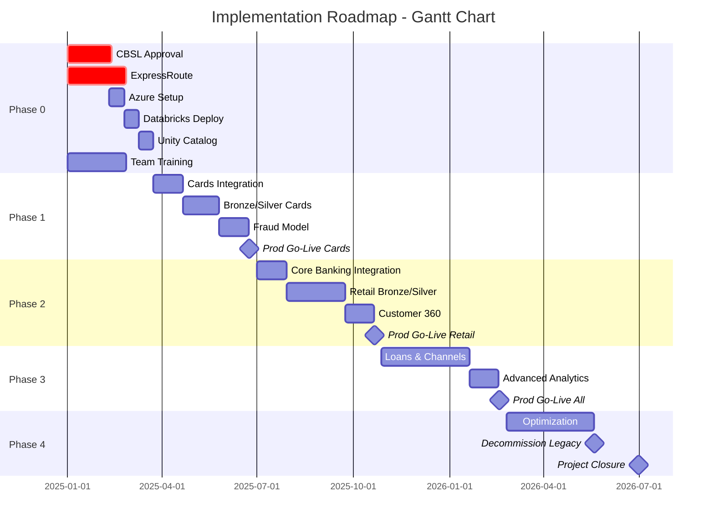

# Phase E: Opportunities & Solutions + Phase F: Migration Planning
## Commercial Bank of Sri Lanka – Implementation Roadmap

---

## PART 1: PHASE E - OPPORTUNITIES & SOLUTIONS

### 1. Introduction

This document defines the implementation roadmap, work packages, and sequencing for Commercial Bank's data platform transformation, bridging the gap from current state to target architecture.

---

### 2. Current State Assessment

#### 2.1 Existing Data Infrastructure

**On-Premises Data Warehouse:**
- Platform: Oracle Exadata X5 (aging, 6 years old)
- Capacity: 80% utilized (200 TB usable)
- Performance: Batch ETL takes 8-12 hours nightly
- Limitations: No real-time capability, expensive to scale

**Data Silos:**
| System | Data | Integration | Issue |
|--------|------|-------------|-------|
| Core Banking (Finacle) | Customers, accounts, transactions | Nightly file extract | 24-hour latency |
| Card System (Way4) | Card auths, settlements | Daily batch | Fraud detection delayed |
| Loan System | Loan accounts, repayments | Weekly extract | Stale NPL reporting |
| CRM (Salesforce) | Marketing segments, campaigns | API (manual) | No integration |
| Mobile Banking | Session logs | File drop to FTP | Not analyzed |

**Pain Points:**
- Manual reconciliation: 2 FTEs spend 40 hours/week reconciling discrepancies
- Reporting backlog: 3-week average time-to-insight for new reports
- No self-service: 80% of reports require IT/BI team intervention
- Compliance risk: CBSL reporting often delayed, manual compilation

#### 2.2 Business Capability Gaps

| Capability | Current Maturity | Target Maturity | Gap |
|------------|------------------|-----------------|-----|
| **Real-Time Analytics** | Level 1 (None) | Level 4 (Real-time) | Critical |
| **Self-Service BI** | Level 2 (Limited) | Level 4 (Widespread) | High |
| **Data Governance** | Level 2 (Manual) | Level 5 (Automated) | High |
| **ML/AI Readiness** | Level 1 (Ad-hoc) | Level 4 (Productionized) | Critical |
| **Regulatory Reporting** | Level 2 (Semi-automated) | Level 5 (Fully automated) | Medium |
| **Customer 360° View** | Level 1 (Fragmented) | Level 5 (Unified) | Critical |

---

### 3. Target State Benefits

#### 3.1 Quantified Benefits (3-Year Horizon)

**Financial Benefits:**
| Benefit | Year 1 | Year 2 | Year 3 | Total (LKR M) |
|---------|--------|--------|--------|---------------|
| Fraud loss reduction | 54M | 90M | 90M | 234M |
| Operational efficiency | 72M | 120M | 120M | 312M |
| Revenue growth (cross-sell) | 60M | 120M | 200M | 380M |
| Regulatory fine avoidance | 30M | 50M | 50M | 130M |
| Infrastructure cost savings | 24M | 40M | 40M | 104M |
| **TOTAL BENEFITS** | **240M** | **420M** | **500M** | **1,160M** |

**vs. Investment (707M over 18 months):**
- **Net Benefit (3Y)**: LKR 453M
- **ROI**: 64%
- **Payback Period**: 22 months

**Non-Financial Benefits:**
- Customer NPS increase: +12 points (from baseline 42 to 54)
- Employee satisfaction: +18% (data teams)
- Time-to-market for new products: 60% faster
- Data-driven culture: 70% of decisions backed by analytics (vs 20% today)

#### 3.2 Risk Reduction

| Risk | Current Exposure | Target Exposure | Mitigation Value |
|------|------------------|-----------------|------------------|
| **Regulatory Penalties** | High (CBSL delays) | Low | LKR 50M/year avoided |
| **Data Breaches** | Medium (siloed systems) | Low (unified governance) | Reputational + LKR 100M+ |
| **Operational Downtime** | High (aging infra) | Low (cloud resilience) | 99.9% SLA |

---

### 4. Implementation Options Analysis

#### 4.1 Option 1: Big Bang Migration (Rejected)

**Approach**: Migrate all systems to Azure Databricks in one 12-month sprint.

**Pros:**
- Fastest time to full benefits
- Single cutover, no parallel running

**Cons:**
- High risk of disruption to customer-facing services
- Overwhelming for team (skill gap)
- No room for learnings/iterations
- Regulatory approval unlikely for such aggressive timeline

**Decision**: ❌ **Rejected** – Too risky for a Tier 1 bank

#### 4.2 Option 2: Phased Domain-by-Domain (Recommended)

**Approach**: Implement domains sequentially (Cards → Retail → Loans → Channels) over 18 months.

**Pros:**
- De-risked: Learnings from each phase inform next
- Early wins: Fraud detection live in Phase 1 (Month 6)
- Skills built incrementally
- Parallel running with legacy (fallback option)

**Cons:**
- Longer time to full benefits
- More complex (dual operations for 12+ months)

**Decision**: ✅ **Selected** – Balances risk and value delivery

#### 4.3 Option 3: Hybrid (Keep Legacy Warehouse)

**Approach**: Databricks for real-time/ML, keep Oracle for traditional BI.

**Pros:**
- Minimal disruption
- Lower short-term cost

**Cons:**
- Perpetuates data silos
- Double infrastructure costs long-term
- Defeats "single source of truth" principle

**Decision**: ❌ **Rejected** – Not strategically aligned

---

### 5. Implementation Roadmap (18 Months)

#### 5.1 Phase Breakdown

```
Timeline: Month 0 → Month 18

Phase 0: Foundation (Month 0-2) ███
Phase 1: Cards & Fraud Detection (Month 3-6) ████
Phase 2: Retail Banking (Month 7-10) ████
Phase 3: Loans & Channels (Month 11-14) ████
Phase 4: Optimization & Rollout (Month 15-18) ████
```

### 5.2 Detailed Phase Plan

---

#### **PHASE 0: FOUNDATION (Months 0-2)**

**Objective**: Establish core infrastructure, governance, and team readiness.

**Work Packages:**

| WP ID | Work Package | Duration | Dependencies | Deliverables |
|-------|--------------|----------|--------------|--------------|
| WP-0.1 | **CBSL Submission & Approval** | 6 weeks | Architecture docs complete | CBSL approval letter |
| WP-0.2 | **ExpressRoute Provisioning** | 8 weeks | Telco contract signed | Live 1 Gbps circuit |
| WP-0.3 | **Azure Subscription Setup** | 2 weeks | CBSL approval | Prod/QA/Dev subscriptions |
| WP-0.4 | **Terraform IaC Development** | 4 weeks | - | Networking, storage, Databricks modules |
| WP-0.5 | **Databricks Workspace Deployment** | 2 weeks | WP-0.3, WP-0.4 | Dev/QA/Prod workspaces |
| WP-0.6 | **Unity Catalog Setup** | 2 weeks | WP-0.5 | Metastore, catalogs, schemas created |
| WP-0.7 | **Team Training** | 8 weeks (parallel) | - | 5 engineers certified (Databricks Associate) |
| WP-0.8 | **CI/CD Pipeline Setup** | 3 weeks | WP-0.5 | Azure DevOps pipelines operational |

**Key Milestones:**
- ✅ **M0.1**: CBSL Approval (Week 6)
- ✅ **M0.2**: ExpressRoute Live (Week 8)
- ✅ **M0.3**: Dev Environment Ready (Week 8)

**Budget**: LKR 60M (USD 200K)

---

#### **PHASE 1: CARDS & FRAUD DETECTION (Months 3-6)**

**Objective**: Deliver first high-value use case—real-time card fraud detection.

**Why Cards First?**
- High business impact (LKR 150M/year fraud losses)
- Real-time requirement (perfect for streaming showcase)
- Smaller data volume (easier to pilot)
- Clear success metric (fraud detection latency <500ms)

**Work Packages:**

| WP ID | Work Package | Duration | Key Activities |
|-------|--------------|----------|----------------|
| WP-1.1 | **Source System Integration** | 4 weeks | Connect to card auth switch (Kafka topic), historical data extract |
| WP-1.2 | **Bronze Layer** | 2 weeks | Auto Loader for historical data, Kafka streaming for real-time |
| WP-1.3 | **Silver Layer - Card Auths** | 3 weeks | DLT pipeline, data quality expectations, deduplication |
| WP-1.4 | **Gold Layer - Fraud Features** | 3 weeks | Feature engineering (velocity checks, geo-location, merchant risk) |
| WP-1.5 | **ML Model Development** | 4 weeks | Train fraud model (XGBoost), model registry, feature store |
| WP-1.6 | **Real-Time Inference** | 3 weeks | Streaming ML inference (<500ms), alerting to fraud ops team |
| WP-1.7 | **UAT & Pilot** | 2 weeks | Parallel run with existing system, A/B testing |
| WP-1.8 | **Production Cutover** | 1 week | Go-live, monitoring, hypercare |

**Data Volumes:**
- Historical: 2 years of card auths (~200M records, 50 GB)
- Real-time: 500 TPS peak

**Success Criteria:**
- ✅ Fraud detection latency <500ms (P95)
- ✅ Model precision >85%, recall >80%
- ✅ Zero customer-facing disruptions during cutover

**Key Milestones:**
- ✅ **M1.1**: Bronze/Silver pipelines live in QA (Month 4)
- ✅ **M1.2**: ML model deployed to QA (Month 5)
- ✅ **M1.3**: Production go-live (Month 6)

**Budget**: LKR 90M (USD 300K)

---

#### **PHASE 2: RETAIL BANKING (Months 7-10)**

**Objective**: Migrate core retail banking data (customers, accounts, transactions), enable Customer 360°.

**Work Packages:**

| WP ID | Work Package | Duration | Key Activities |
|-------|--------------|----------|----------------|
| WP-2.1 | **Core Banking Integration** | 4 weeks | CDC setup from Finacle, API for real-time queries |
| WP-2.2 | **Master Data Management** | 3 weeks | Customer golden record, deduplication, survivorship rules |
| WP-2.3 | **Bronze/Silver - Customers & Accounts** | 4 weeks | DLT pipelines, NIC masking, row-level security |
| WP-2.4 | **Bronze/Silver - Transactions** | 4 weeks | Streaming + batch, partitioning by date, z-ordering |
| WP-2.5 | **Gold - Customer 360°** | 4 weeks | Denormalized view: demographics + accounts + txns + loans + cards |
| WP-2.6 | **Regulatory Reporting** | 3 weeks | CBSL FSD returns automation (Financial Sector Directions) |
| WP-2.7 | **Power BI Dashboards** | 3 weeks | Customer analytics, branch performance, transaction trends |
| WP-2.8 | **Reconciliation & UAT** | 2 weeks | Row count validation, balance checks vs core banking |
| WP-2.9 | **Production Cutover** | 1 week | Retire Oracle warehouse ETL jobs for retail domain |

**Data Volumes:**
- Customers: 2.5M records, 5 GB
- Accounts: 4M records, 8 GB
- Transactions: 600M/year (~2M/day), 500 GB/year

**Success Criteria:**
- ✅ Reconciliation: 99.99% match with core banking
- ✅ Customer 360° query: <2 seconds
- ✅ CBSL FSD report: Automated, <24 hours from month-end

**Key Milestones:**
- ✅ **M2.1**: Customer/Account data in Silver (Month 8)
- ✅ **M2.2**: Customer 360° MVP live (Month 9)
- ✅ **M2.3**: Production cutover (Month 10)

**Budget**: LKR 120M (USD 400K)

---

#### **PHASE 3: LOANS & CHANNELS (Months 11-14)**

**Objective**: Complete remaining domains—loans and digital channels.

**Work Packages:**

| WP ID | Work Package | Duration | Key Activities |
|-------|--------------|----------|----------------|
| WP-3.1 | **Loans Integration** | 3 weeks | Extract from loan system, CDC for active loans |
| WP-3.2 | **Loans Bronze/Silver** | 3 weeks | DLT pipelines, NPL classification, collateral tracking |
| WP-3.3 | **Loans Gold - Portfolio Analytics** | 3 weeks | Loan book summary, NPL trending, credit risk metrics |
| WP-3.4 | **Channels Integration** | 3 weeks | Mobile app logs, internet banking, ATM switch feeds |
| WP-3.5 | **Channels Bronze/Silver** | 3 weeks | Session analytics, device fingerprinting, fraud risk scoring |
| WP-3.6 | **Channels Gold - Customer Journey** | 3 weeks | Omnichannel view, A/B testing data, churn prediction |
| WP-3.7 | **Advanced Analytics Use Cases** | 4 weeks | Credit scoring model, churn prediction, next-best-offer |
| WP-3.8 | **UAT & Cutover** | 2 weeks | Parallel run, validation, go-live |

**Data Volumes:**
- Loans: 450K active loans, 10 GB
- Mobile sessions: 120M/year, 30 GB
- Internet banking: 40M sessions/year, 10 GB

**Success Criteria:**
- ✅ NPL reporting: Real-time dashboard (vs monthly manual report)
- ✅ Churn model: Precision >75%, recall >70%

**Key Milestones:**
- ✅ **M3.1**: Loans data in Silver (Month 12)
- ✅ **M3.2**: Channels data in Silver (Month 13)
- ✅ **M3.3**: All domains live in Prod (Month 14)

**Budget**: LKR 100M (USD 333K)

---

#### **PHASE 4: OPTIMIZATION & ROLLOUT (Months 15-18)**

**Objective**: Optimize platform, decommission legacy systems, scale adoption.

**Work Packages:**

| WP ID | Work Package | Duration | Key Activities |
|-------|--------------|----------|----------------|
| WP-4.1 | **Performance Tuning** | 4 weeks | Z-ordering, caching, Photon optimization, cost review |
| WP-4.2 | **Self-Service Enablement** | 6 weeks | Train 50+ analysts, SQL Warehouse access, BI tool rollout |
| WP-4.3 | **Governance Hardening** | 4 weeks | Audit policy enforcement, quarterly access reviews, DLP policies |
| WP-4.4 | **Legacy System Decommissioning** | 8 weeks | Migrate remaining Oracle warehouse jobs, shut down Exadata |
| WP-4.5 | **DR Testing** | 2 weeks | Simulate region failure, validate RTO/RPO |
| WP-4.6 | **Documentation & Knowledge Transfer** | 4 weeks | Runbooks, architecture docs, training materials |
| WP-4.7 | **Hypercare & Stabilization** | 12 weeks | 24/7 support, bug fixes, minor enhancements |

**Success Criteria:**
- ✅ Self-service adoption: 80% of users creating own reports
- ✅ Legacy system decommissioned: Oracle license savings LKR 40M/year
- ✅ DR test passed: RTO <2 hours validated

**Key Milestones:**
- ✅ **M4.1**: Oracle Exadata decommissioned (Month 17)
- ✅ **M4.2**: Platform handover to BAU team (Month 18)
- ✅ **M4.3**: Project closure (Month 18)

**Budget**: LKR 80M (USD 267K)

---

### 6. Work Package Dependencies



---

### 7. Resource Plan

#### 7.1 Core Team Structure

| Role | FTE | Duration | Responsibility |
|------|-----|----------|----------------|
| **Program Manager** | 1 | 18 months | Overall delivery, stakeholder mgmt, CBSL liaison |
| **Enterprise Architect** | 1 | 18 months | Architecture governance, standards, reviews |
| **Lead Data Engineer** | 1 | 18 months | Databricks platform, DLT pipelines, performance |
| **Senior Data Engineers** | 3 | 18 months | Domain pipelines (cards, retail, loans, channels) |
| **Data Scientist** | 1 | Months 3-10 | ML models (fraud, churn, credit scoring) |
| **DevOps Engineer** | 1 | 18 months | CI/CD, IaC (Terraform), monitoring |
| **Security Architect** | 0.5 | Months 0-6 | CMK, NSGs, compliance, pen-testing |
| **Business Analyst** | 1 | 18 months | Requirements, UAT, user training |
| **Data Governance Lead** | 0.5 | Months 6-18 | Unity Catalog policies, data quality, lineage |

**Total Core Team**: ~10 FTEs

#### 7.2 External Support

| Partner | Role | Duration | Cost (LKR M) |
|---------|------|----------|--------------|
| **Implementation Partner** | Databricks + Azure consulting | 6 months (Phases 0-1) | 150M |
| **CBSL Consultant** | Regulatory compliance advisory | 3 months | 15M |
| **Network Integrator** | ExpressRoute setup | 2 months | 10M |

#### 7.3 Skills Development

| Training | Target Audience | Duration | Provider | Cost (LKR M) |
|----------|----------------|----------|----------|--------------|
| **Databricks Associate** | 5 engineers | 2 weeks | Databricks Academy | 2M |
| **Databricks Professional** | 2 engineers | 2 weeks | Databricks Academy | 1.5M |
| **Azure Fundamentals** | 10 team members | 1 week | Microsoft Learn (self-paced) | 0.5M |
| **Delta Lake Deep-Dive** | 5 engineers | 3 days | Implementation partner | 1M |

---

### 8. Risk Management

#### 8.1 Top 10 Risks & Mitigation

| Rank | Risk | Probability | Impact | Mitigation | Owner |
|------|------|-------------|--------|------------|-------|
| 1 | **CBSL approval delayed** | Medium | High | Early engagement, pre-submission meetings, hire CBSL consultant | Program Manager |
| 2 | **ExpressRoute lead time** | Medium | High | Order immediately, parallel setup of VPN backup | Network Team |
| 3 | **Skills gap** | High | Medium | 8-week training program, implementation partner support | HR + PM |
| 4 | **Source system integration issues** | High | Medium | POC phase, contingency budget for custom connectors | Lead Engineer |
| 5 | **Data quality issues** | High | Medium | Robust bronze layer, quality dashboards, source system owners accountable | Data Engineer |
| 6 | **Scope creep** | Medium | Medium | Strict change control board, phase-gate approvals | PM |
| 7 | **Key personnel turnover** | Medium | High | Cross-training, documentation, retention bonuses | PM + HR |
| 8 | **Databricks platform downtime** | Low | High | 99.95% SLA with Databricks, fallback to legacy (Phase 1-3) | DevOps |
| 9 | **Budget overrun** | Medium | High | 15% contingency reserve, monthly cost tracking | PM + CFO |
| 10 | **User adoption resistance** | Medium | Medium | Change management program, early wins (fraud detection), executive sponsorship | Business Analyst |

---

## PART 2: PHASE F - MIGRATION PLANNING

### 9. Migration Strategy

#### 9.1 Migration Approach: Trickle & Cutover Hybrid

**Trickle Migration:**
- Historical data: Bulk-load from legacy warehouse to bronze layer
- Incremental updates: Daily/hourly sync until cutover

**Cutover:**
- Phase-by-phase domain cutover (not all-at-once)
- Parallel running: 2-4 weeks per domain
- Rollback plan: Keep legacy system operational until validation complete

#### 9.2 Data Migration Waves

| Wave | Domain | Data Volume | Strategy | Duration |
|------|--------|-------------|----------|----------|
| **Wave 1** | Cards (historical) | 50 GB | Full extract → ADLS → DLT | 1 week |
| **Wave 1** | Cards (real-time) | Streaming | Kafka parallel run | 2 weeks |
| **Wave 2** | Retail (historical) | 500 GB | Incremental extract (partitioned) | 2 weeks |
| **Wave 2** | Retail (CDC) | Real-time | Debezium CDC from Finacle | 2 weeks |
| **Wave 3** | Loans (historical) | 10 GB | Full extract | 3 days |
| **Wave 4** | Channels (historical) | 40 GB | Full extract | 1 week |

---

### 10. Migration Execution Plan (Phase 1 Example: Cards)

#### 10.1 Pre-Migration (Week -2 to -1)

**Activities:**
- [ ] Finalize card auth switch Kafka topic configuration
- [ ] Set up bronze/silver/gold schemas in Unity Catalog
- [ ] Deploy DLT pipelines to QA environment
- [ ] Smoke test with synthetic data
- [ ] Prepare rollback scripts

**Go/No-Go Criteria:**
- ✅ Databricks workspace in prod environment stable
- ✅ Kafka connectivity tested
- ✅ Historical extract file ready (validated)
- ✅ UAT sign-off from fraud ops team

#### 10.2 Migration Execution (Week 0)

**Day 1-2: Historical Load**
- Extract 2 years of card auth data from card system (200M records)
- Upload to ADLS `/raw/cards/authorizations_historical/`
- Trigger DLT pipeline to process bronze → silver
- Validate row counts (source vs lake)

**Day 3-4: Streaming Setup**
- Enable Kafka topic `cmb-card-auths` (shadow mode, no actions on results yet)
- Start Databricks streaming job
- Monitor lag, throughput, errors

**Day 5-7: Parallel Run**
- Run fraud model on historical + streaming data
- Compare fraud alerts: Legacy system vs Databricks
- Measure latency: Target <500ms (P95)

**Day 8: Cutover Decision**
- Review validation report
- If pass: Switch fraud ops team to Databricks dashboard
- If fail: Rollback to legacy, debug, reschedule

#### 10.3 Post-Migration (Week +1 to +4)

**Hypercare:**
- 24/7 on-call rotation (2 engineers)
- Daily stand-ups with fraud ops team
- Monitoring: Databricks system tables, Azure Monitor

**Validation:**
- Weekly reconciliation: Fraud alerts detected (Databricks vs legacy)
- Performance report: Latency, throughput, cost
- User feedback: Fraud ops team satisfaction survey

**Stabilization:**
- Week +4: Hand over to BAU support team
- Decommission legacy fraud detection batch job
- Archive historical data from card system

---

### 11. Rollback Procedures

#### 11.1 Rollback Triggers

| Trigger | Threshold | Action |
|---------|-----------|--------|
| **Data loss** | Any missing transactions | Immediate rollback |
| **Performance degradation** | Fraud detection latency >2 seconds (sustained) | Rollback within 4 hours |
| **System instability** | >3 critical errors in 24 hours | Rollback within 8 hours |
| **User rejection** | Fraud ops team unable to use dashboards | Rollback + training |

#### 11.2 Rollback Steps

1. **Pause Databricks streaming jobs** (stop writing to lake)
2. **Re-enable legacy system jobs** (pre-configured, kept on standby)
3. **Redirect Kafka topic** to legacy consumer (if applicable)
4. **Communicate to stakeholders** (SLA: 1-hour notification)
5. **Root cause analysis** (within 24 hours)
6. **Remediation plan** (within 48 hours)

#### 11.3 Rollback Testing

- **Rehearsal**: Dry-run rollback in QA environment (Week -1)
- **Documentation**: Step-by-step runbook with screenshots
- **Team Training**: All engineers walk through rollback procedure

---

### 12. Migration Governance

#### 12.1 Migration Control Board

**Members:**
- Program Manager (Chair)
- Lead Data Engineer
- Business Unit Sponsor (e.g., Head of Cards for Phase 1)
- CISO Representative
- Change Manager

**Meeting Cadence:**
- Weekly during migration waves
- Ad-hoc for Go/No-Go decisions

**Decisions:**
- Approve Go-Live
- Approve Rollback
- Approve Scope Changes

#### 12.2 Migration Metrics (KPIs)

| Metric | Target | Measurement |
|--------|--------|-------------|
| **Data Completeness** | 100% (zero missing records) | Row count comparison |
| **Data Accuracy** | 99.99% match with source | Sample validation (1,000 records) |
| **Performance (Fraud Latency)** | <500ms (P95) | Databricks metrics |
| **Downtime** | 0 (zero customer impact) | Service availability monitoring |
| **Rollback Incidents** | 0 (goal) | Incident log |
| **User Satisfaction** | >80% (post-migration survey) | Survey after 2 weeks |

---

### 13. Change Management Plan

#### 13.1 Stakeholder Communication

| Audience | Message | Frequency | Channel |
|----------|---------|-----------|---------|
| **Executive Sponsors** | High-level progress, risks, ROI tracking | Monthly | Steering Committee |
| **Business Unit Leaders** | Use case progress, UAT readiness | Bi-weekly | Email + Workshops |
| **End Users (Analysts)** | Training, new features, go-live dates | Weekly | Slack + Town Halls |
| **IT Operations** | Technical changes, support handover | Daily (during migration) | Stand-ups |
| **CBSL (Regulator)** | Architecture updates, compliance evidence | Quarterly | Formal submissions |

#### 13.2 Training Programs

| Program | Audience | Duration | Delivery |
|---------|----------|----------|----------|
| **Databricks Essentials** | Analysts (50 users) | 2 days | Virtual classroom |
| **SQL Warehouse for BI** | BI developers (10 users) | 1 day | Hands-on lab |
| **Unity Catalog Governance** | Data stewards (5 users) | 1 day | Workshop |
| **Power BI + Databricks** | Business users (100 users) | 3 hours | Webinar |

#### 13.3 Adoption Metrics

| Metric | Baseline | Target (Month 12) | Actual (to be tracked) |
|--------|----------|-------------------|------------------------|
| **Self-Service Report Creation** | 20% of users | 80% | TBD |
| **SQL Warehouse Active Users** | 0 | 150 | TBD |
| **Databricks Logins (Monthly)** | 0 | 200 | TBD |
| **Legacy Warehouse Queries** | 10,000/month | <500/month | TBD |

---

### 14. Success Criteria (Overall Program)

#### 14.1 Technical Success

- ✅ All 4 domains (Cards, Retail, Loans, Channels) migrated and operational
- ✅ Real-time fraud detection live with <500ms latency
- ✅ Customer 360° query response <2 seconds
- ✅ Unity Catalog governance enforced (100% tables governed)
- ✅ Zero data breaches or security incidents
- ✅ Platform availability: 99.9% (< 9 hours downtime/year)

#### 14.2 Business Success

- ✅ Fraud losses reduced by 60% (LKR 90M/year savings)
- ✅ CBSL reporting time: <24 hours (from 5 days)
- ✅ Self-service adoption: 80% of users
- ✅ Time-to-insight: Hours (from weeks)
- ✅ Net Promoter Score (NPS): +12 points improvement

#### 14.3 Financial Success

- ✅ Total Cost of Ownership (TCO): Within LKR 750M budget (±10%)
- ✅ ROI: >50% by end of Year 3
- ✅ Payback period: <24 months
- ✅ Legacy system decommissioned: LKR 40M/year savings

---

### 15. Post-Implementation Support Model

#### 15.1 BAU (Business As Usual) Transition

**Timeline**: Month 18-24

**Activities:**
- Knowledge transfer from project team to BAU team (3 months overlap)
- Runbook creation: 50+ operational procedures documented
- L1/L2/L3 support model established
- Vendor support contracts (Databricks, Microsoft) activated

**BAU Team Structure:**

| Role | FTE | Responsibility |
|------|-----|----------------|
| **Platform Owner (Chief Data Officer)** | 1 | Strategy, roadmap, budget |
| **Data Platform Manager** | 1 | Day-to-day operations, vendor mgmt |
| **Senior Data Engineers** | 3 | Pipeline maintenance, new use cases |
| **DevOps Engineer** | 1 | Infrastructure, CI/CD, monitoring |
| **Data Governance Analyst** | 1 | Unity Catalog policies, access reviews |
| **Support Analyst (L1)** | 2 | User support, incident triage |

#### 15.2 Continuous Improvement

**Quarterly Reviews:**
- Platform performance review
- Cost optimization opportunities
- New use case prioritization
- Technology updates (Databricks releases)

**Annual Activities:**
- Architecture health check
- Security audit & pen-testing
- CBSL compliance re-certification
- DR test

---

### 16. Lessons Learned Framework

#### 16.1 Retrospective Cadence

- **End of Each Phase**: What went well, what didn't, actions
- **Mid-Project (Month 9)**: Major retrospective, adjust roadmap if needed
- **Project Closure (Month 18)**: Final retrospective, document for future projects

#### 16.2 Key Learnings Captured

| Area | Learning | Action for Future |
|------|----------|-------------------|
| **Vendor Management** | Databricks support response time varies | Negotiate Premium Support SLA |
| **Skills** | Python proficiency was a bottleneck | Start training 3 months earlier |
| **Scope** | Business requested 20+ new features mid-project | Stricter change control |
| **Integration** | Legacy system APIs were undocumented | Budget for API discovery phase |

---

### 17. Approvals

| Role | Name | Signature | Date |
|------|------|-----------|------|
| **Program Manager** | [Name] | | |
| **CIO (Sponsor)** | [Name] | | |
| **Chief Risk Officer** | [Name] | | |
| **Head of Retail Banking** | [Name] | | |
| **Enterprise Architect** | [Name] | | |

---

### 18. Document Control

- **Version**: 1.0
- **Status**: Draft for Approval
- **Last Updated**: December 2025
- **Next Review**: After Steering Committee Approval
- **Classification**: Internal - Confidential
- **Owner**: Program Management Office

---

**End of Phase E & F: Implementation Roadmap & Migration Planning**
