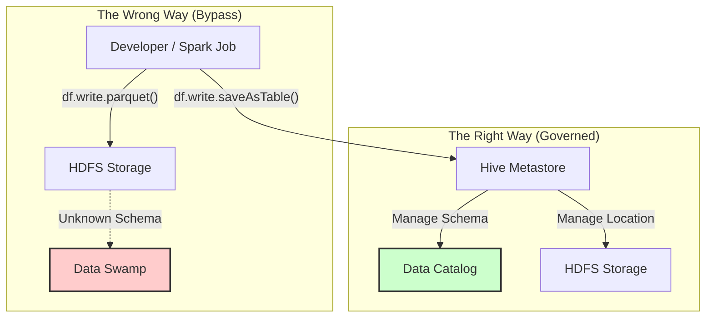

# Enforcing Hive Metastore as the "Single Source of Truth"

You are absolutely correct. A major risk in Spark development is that developers might just write files to disk (HDFS/S3) without registering them in the Hive Metastore. If they do this, the schema is "locked" inside the code and the file headers, and the central catalog (Hive) knows nothing about it.

**Yes, it is possible (and recommended) to force all table creations to go through the Hive Metastore.**

Here is how you ensure that "All Roads Lead to Hive Metastore".

## 1. The "Golden Configuration" for Spark

To ensure Spark talks to the shared Hive Metastore (and not its own private, temporary one), you **must** configure the `SparkSession` correctly.

### The Critical Setting: `enableHiveSupport()`
In your Spark code, you must explicitly enable Hive support. If you don't, Spark uses a local, in-memory catalog that disappears when the job finishes.

**Correct Way (Registers in HMS):**
```python
from pyspark.sql import SparkSession

spark = SparkSession.builder \
    .appName("Bank_ETL_Job") \
    .config("spark.sql.catalogImplementation", "hive") \
    .config("hive.metastore.uris", "thrift://hive-metastore-host:9083") \
    .enableHiveSupport() \
    .getOrCreate()

# When you run this, the table is registered in Hive and visible to everyone
df.write.saveAsTable("marketing_db.promo_results")
```

**The "Bypass" Way (Avoid this):**
```python
# This writes data but NOBODY knows it exists except this script
df.write.parquet("/data/marketing/promo_results") 
```

## 2. How to Enforce This? (Governance)

Since you cannot physically stop a developer from writing a file to a folder they have access to, you enforce the Metastore usage through **Process and Permissions**.

### A. Restrict Direct File Access (HDFS/S3 Permissions)
*   **Rule**: Developers/Service Accounts should **NOT** have write access to the "Gold/Production" data folders directly.
*   **Mechanism**: They should only have permission to execute `CREATE TABLE` or `INSERT` statements via the Hive/Spark SQL engine.
*   **Result**: If a developer tries to do `df.write.parquet("/prod/data")`, it fails with `Permission Denied`. They *must* use `df.write.saveAsTable(...)` which goes through the Metastore service account.

### B. Code Review & CI/CD Checks
Scan your Spark code repositories for "Direct File Writes".

*   **Flag/Reject**: `df.write.parquet(...)`, `df.write.csv(...)`, `df.write.save(...)`
*   **Approve**: `df.write.saveAsTable(...)`, `df.write.insertInto(...)`

### C. Use "Managed Tables"
Encourage the use of **Managed Tables** (Internal Tables) instead of External Tables where possible for intermediate data.
*   **Managed Table**: Hive manages both the metadata AND the data. If you drop the table, the data is gone. This ensures the Metastore and the Data are always in sync.

## 3. The "External Table" Compromise
Sometimes you *must* write files directly (e.g., for performance or interoperability with other tools). In this case, you must enforce a **"Register Immediately"** rule.

**Pattern:**
1.  Spark writes files to `/data/path`.
2.  Spark **immediately** runs:
    ```sql
    ALTER TABLE my_table RECOVER PARTITIONS;
    -- OR --
    CREATE EXTERNAL TABLE IF NOT EXISTS ... LOCATION '/data/path';
    ```

## Summary Architecture


